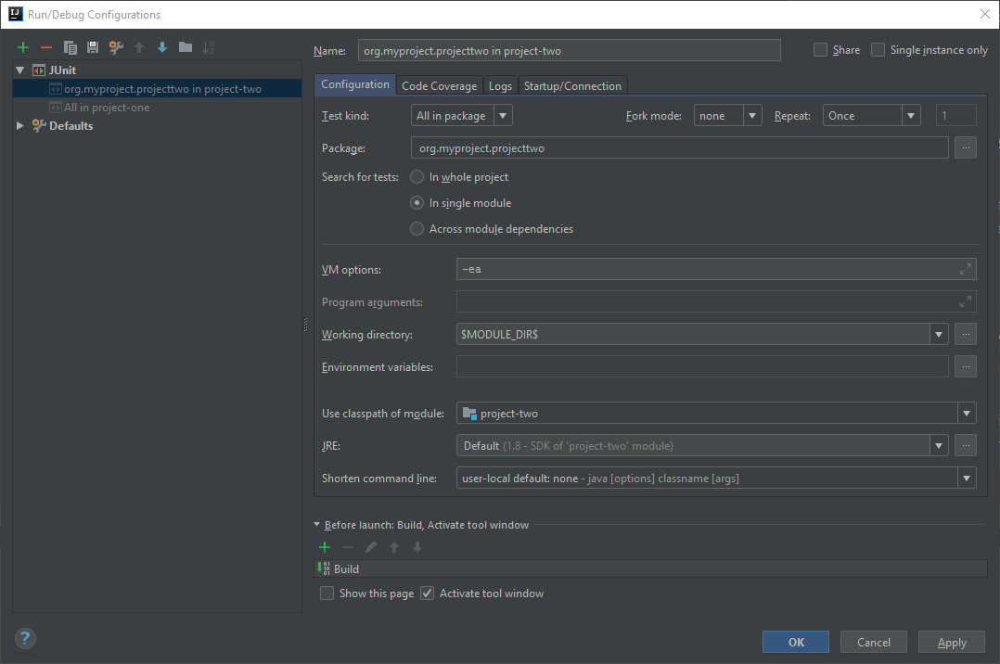

# junit5-intellij

Project that showcases an anomaly in IntelliJ when executing junit5 tests under certain conditions.

## Background

The code project consist of a Maven multi module project `junit5-intellij` having two child modules, `project-one` and `project-two`.
 
`project-two` contains tests but also a test utility class for generating a test object. The test code of project-two is packaged into a jar using the goal _test-jar_ of `maven-jar-plugin` 

    <plugin>
        <groupId>org.apache.maven.plugins</groupId>
        <artifactId>maven-jar-plugin</artifactId>
        <version>2.6</version>
        <executions>
            <execution>
                <goals>
                    <goal>test-jar</goal>
                </goals>
            </execution>
        </executions>
    </plugin>

`project-one` is using the above test jar file as well, it gains access to it by adding the below dependency in the pom.xml of project-one.

    <dependency>
        <groupId>org.myproject</groupId>
        <artifactId>project-two</artifactId>
        <version>${project.version}</version>
        <type>test-jar</type>
        <scope>test</scope>
    </dependency>
    
`project-one` has one test class, `org.myproject.projectone.ProjectOneTest`.

`project-two` has one test class, `org.myproject.projectywo.ProjectTwoTest`.
    
## Issue

When executing the tests of `project-one` in IntelliJ by selecting **project-one -> Run 'All Tests'**, the expected outcome is that the tests in class `ProjectOneTest` are run. 

The actual outcome is that the tests of both `ProjectOneTest` and `ProjectTwoTest` are executed.

Note that the default Run/Debug Configurations are used here, without modifications.

When running the same setup in Intellij using junit4, it works as expected, tests in `ProjectOneTest` are the only ones that are executed. The same goes if the test are executed via Maven surefire plugin.

**Result of project-two -> Run 'All Tests'**

When the tests of `project-two` are executed, both test cases are successful.
The test `ProjectTwoTest.secondTestOfProjectTwo()` processes a file that is read from classpath, originally located in `project-two/src/main/resources`.

**Result of project-one -> Run 'All Tests'**

When executing the tests of `project-one`, the tests of `ProjectTwoTest` are detected and executed as well. 
In this case the test `ProjectTwoTest.secondTestOfProjectTwo()` will fail since it is executed using the classpath of `project-one`, and hence the file in `project-two/src/main/resources` will be missing i classpath.

## Workaround

One possible workaround is to edit the Run/Debug Configuration to explicitly point out the package to include tests from:

